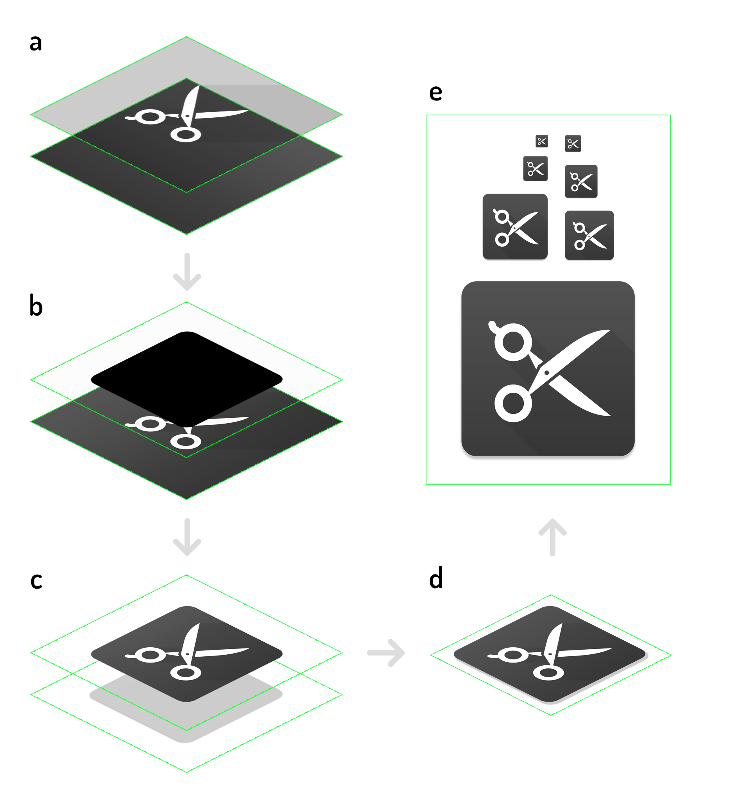

# grunt-render-adaptive-icon

> Grunt plugin for rendering backwards compatible images from Android adaptive icons

### Grunt
If you haven't used [Grunt](http://gruntjs.com/) before, be sure to check out the [Getting Started](http://gruntjs.com/getting-started) guide, as it explains how to create a [Gruntfile](http://gruntjs.com/sample-gruntfile) as well as install and use Grunt plugins. Once you're familiar with that process, you may install this plugin with this command:

```shell
npm install grunt-render-adaptive-icon --save-dev
```

One the plugin has been installed, it may be enabled inside your Gruntfile with this line of JavaScript:

```js
grunt.loadNpmTasks('grunt-render-adaptive-icon');
```


## The "rendericon" task

### Overview
In your project's Gruntfile, add a section named `rendericon` to the data object passed into `grunt.initConfig()`.

```js
grunt.initConfig({
    rendericon: {
        android_icons: {
            options: {
                    foreground: 'example/template/foreground.png',
                    background: 'example/template/background.png',
                    mask: 'example/template/mask.png',
                    shadow: 'example/template/shadow.png',
                    crop: { width: 768, height: 768, left: 128, top: 128 }
            },
            files: [
                    { width: 36, height: 36, dest: 'example/output/ldpi-icon.png' },
                    { width: 48, height: 48, dest: 'example/output/mdpi-icon.png' },
                    { width: 72, height: 72, dest: 'example/output/hdpi-icon.png' },
                    { width: 96, height: 96, dest: 'example/output/xhdpi-icon.png' },
                    { width: 144, height: 144, dest: 'example/output/xxhdpi-icon.png' },
                    { width: 192, height: 192, dest: 'example/output/xxxhdpi-icon.png' },
                    { width: 512, height: 512, dest: 'example/output/google-play.png', mask: false, crop: { width: 720, height: 720, left: 152, top: 152 }  }            
            ]
        }
    }
})
```

This plugin can be used to automatically generate backwards compatible versions of an Android adaptive icon. Adaptive icons consist of a foreground image and a background image which will be composited on top of each other. Different variants of Android will then use different shapes to cut out the actual icon. One variant might use circular icons, another squares, squares with rounded corners or squircles. See for more infomation the [Android developer website](https://developer.android.com/guide/practices/ui_guidelines/icon_design_adaptive).

For backwards capatibility it may be needed to also provide a regular old icon in various sizes. This plugin will automate that process.



In the first step a) the foreground will be composited on top of the background. In the next step b) the mask will be used to cut out the shape of the icon. In this case it will be a rounded rect. During step c) the resulting icon will be composited on top of the shadow. The next step is d) where the image will be cropped which results in our final icon, which will be scaled (e) to all the sizes specified. 

### Uniform icons for the Play Store

In addition to these backwards compatible versions of the adaptive icon, we can also use the orignal icon assets to create a new [Uniformed icon for the Play Store](https://developer.android.com/google-play/resources/icon-design-specifications). 

Uniformed icons that are submitted to the Play Store must be 512 x 512 pixels large and must not have a predefined shape. Instead it must be a square without any shadows. The Play Store will apply it's own rounded mask and shadow to ensure consistency across all app icons in the store. 

In the last example of the configuration above you'll notice we are generating a 512 x 512 pixel version of the icon with masking turned off. We also use a slightly tighter crop compared to the other icons to make sure our artwork is properly sized.


### Configuration options

#### options.foreground
Type: `String`

The foreground image for the adaptive icon. It would be best to use large version of the adaptive image as a base, for example 1024 x 1024 as we can use that scale down to all required sizes of icons while still maintaining a crisp image.

#### options.background
Type: `String`

The background image for the adaptive icon. It needs to be the same size of the foreground image.

#### options.mask
Type: `String`

An image that will be used as a mask to cut out the icon in a particular shape. It needs to be the same size of the foreground image. The image needs to be transparent, with solid black for the area of the icon. An example image is provided in this repository. It needs to be the same size of the foreground image.

#### options.shadow
Type: `String`

An image that will be used to add a shadow behind the icon, if needed. An example image is provided in this repository.

#### options.crop
Type: `Object`

Because adaptive icons contain extra space outside of the main safe area, the rendered icon needs to be cut to size. This object will contain `width`, `height`, `top` and `left` to determine the area that needs to be cut out. This area depends on the mask image that is provided. 


### Files

A set of output file that will be generated from the source file. 
For each file the following settings can be defined:

#### file.width
Type `Number`

The width of the output image. 

#### file.height
Type `Number`

The height of the output image. 

#### file.dest
Type: `String`

The path and name of the output file for that will be generated for this particular size.

#### file.mask
Type: `String` or `Boolean`

Overwrite the mask option for an individual output file. Can be `false` to turn off masking for this file. This is especially useful to generate a new uniformed icon asset for the Play Store. 

#### file.shadow
Type: `String` or `Boolean`

Overwrite the shadow option of an individual output file. 

#### file.crop
Type: `Object`

Overwrite the crop option of an individual output file. 


